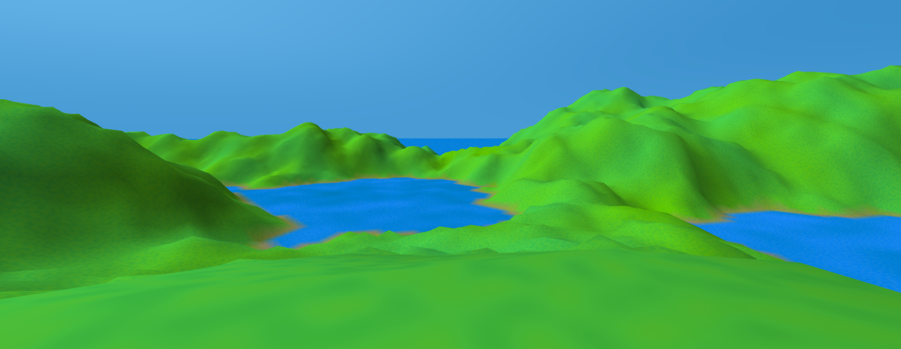

aframe-atoll-terrain
====================

An [A-Frame](https://aframe.io) [WebVR](https://webvr.info/) primitive that has a circle of high-resolution terrain near the origin,
surrounded by a low-resolution sea or plain that stretches to the horizon.
Optionally, the high-resolution area can include a central plateau or sea.

Uses a grid of equilateral triangles for efficiency.

Pairs well with [aframe-simple-sun-sky](https://www.npmjs.com/package/aframe-simple-sun-sky)
or [aframe-sun-sky](https://www.npmjs.com/package/aframe-sun-sky)



[live example scene](https://dougreeder.github.io/aframe-atoll-terrain/example.html)
On desktop, drag to turn and use WASD keys to move.
Reload several time to see some variations.


Usage
---

Include using 
```html
<script src="https://unpkg.com/aframe-atoll-terrain@^0.4.0/dist/aframe-atoll-terrain.js"></script>
```


Declare it as a direct child of the scene (normally):
```html
<a-scene>
    <a-atoll-terrain plateau-radius="5" plateau-elevation="25" middle-radius="400" unit-size="4" far="4000"
                     land-yin-color="#528d04" land-yang-color="#278d53" sea-yin-color="#005e85" sea-yang-color="#2571cf"
                     sun-position="0.8 0.6 0">
    </a-atoll-terrain>
    <!-- ... -->
</a-scene>
```


Parameters 
---
Typically, you'll leave the entity position and rotation as zero, but you don't have to.


### plateau-radius
* default: 10
* minimum: 0
* maximum: middle-radius

Radius of the central plateau, in meters.
If radius is 0, there is no plateau.


### plateau-elevation
* default: 1

Set to 0 to make the "plateau" part of the sea.


### middle-radius
* default: 100

Radius of the high-resolution area, in meters.


### unit-size
* default: 1

Distance between vertexes in the high-resolution area, in meters.

Will be adjusted to be a simple fraction of middle-radius, if necessary.


### far
* default: 4000
* minimum: middle-radius + unit-size

Radius of the low-resolution plain, in meters. 
Thus, it's also the distance to the effective horizon. 
Should be about 80% of the radius of your sky sphere.


### land-yin-color, land-yang-color
* defaults: #528d04, #278d53

The color of the land smoothly varies between these two extremes.
Typically, you'll want them to vary mostly by hue and saturation, rather than intensity.
Noise will cause brief excursions outside this range.


### sea-yin-color, sea-yang-color
* defaults: #528d04, #278d53

The color of the sea smoothly varies between these two extremes.


### sun-position
* default: {x:-1.0, y:1.0, z:-1.0}

The direction from which the sun is shining.
This primitive ignores directional lights, but others may use them.
If you're using one of the *-sun-sky primitives, set its sun-position to the same value.


### shader
* default: 'vertex-color+noise'

If you use a different shader, the colors and sun-position will probably be ignored.


### log
* default: false

Whether to write diagnostic data to the console. 


Development
---
`npm install`

edit files

`npm run-script build`


Internals
---
The geometry component sets vertex colors, so you should probably use a material that uses them.
